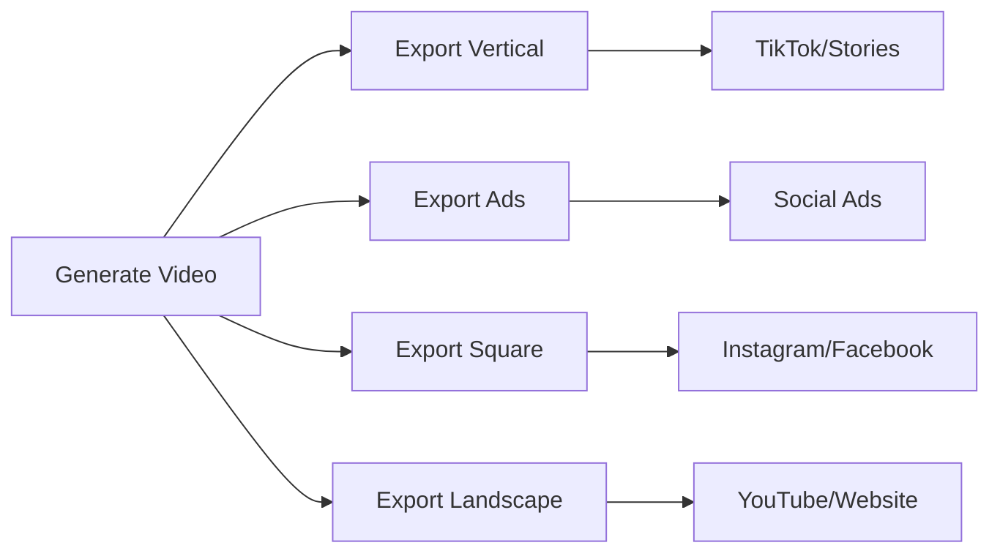

## What is Video Export?

Video export is the process of converting your generated video into a downloadable MP4 file. After video generation is complete, you use the export endpoints to create a final video file that you can download, share, or integrate into your applications.

## Export Process

The export process follows these steps:

<Steps>
  <Step title="Complete Video Generation">
    Ensure your video generation is finished with `status: "completed"`.
  </Step>
  <Step title="Start Export">
    Call `/export/start` with the `video_id` from generation.
  </Step>
  <Step title="Monitor Progress">
    Poll `/export/status/{jobId}` to track export progress.
  </Step>
  <Step title="Download Video">
    Get the download URL when export status becomes `completed`.
  </Step>
</Steps>

## Export Formats

You can export videos in different formats optimized for various platforms:

<CardGroup cols={2}>
  <Card title="Vertical (9:16)" icon="mobile">
    **1080x1920 pixels**
    Perfect for:
    - TikTok
    - Instagram Stories
    - YouTube Shorts
    - Snapchat
  </Card>
  <Card title="Ads (4:5)" icon="rectangle-vertical">
    **1080x1350 pixels**
    Ideal for:
    - Instagram ads
    - Facebook ads
    - Social media advertising
    - Promotional content
  </Card>
  <Card title="Square (1:1)" icon="square">
    **1080x1080 pixels**
    Great for:
    - Instagram feed posts
    - Facebook posts
    - LinkedIn posts
    - Twitter videos
  </Card>
  <Card title="Landscape (16:9)" icon="desktop">
    **1920x1080 pixels**
    Best for:
    - YouTube videos
    - Website embeds
    - Presentations
    - Display content
  </Card>
  <Card title="Custom" icon="sliders">
    **Custom dimensions (up to 5000x5000)**
    Perfect for:
    - Specific platform requirements
    - Custom aspect ratios
    - Non-standard displays
    - Special projects
  </Card>
</CardGroup>

## Export Costs

### High Resolution Surcharge

Videos exported at resolutions exceeding 1080p (width > 1920px OR height > 1080px) incur an additional cost:

<Card title="High Resolution Cost" icon="expand">
  **+2.5 credits per 30 seconds**
  
  Applies when exporting at resolutions above 1080p (e.g., 4K, custom high-res formats).
  This surcharge is added to the base export cost.
</Card>

<Warning>
The high resolution surcharge applies to **all videos** (both API-generated and dashboard-created) when exporting at resolutions exceeding 1080p.
</Warning>

### Avatar Quality Models

When your video includes an avatar, you can choose from five quality models with different performance and cost characteristics:

<CardGroup cols={2}>
  <Card title="Standard" icon="zap">
    **Free**
    
    Basic avatar quality that works well for most use cases. No additional credits required.
    
    **Best for:**
    - Quick exports
    - Budget-conscious projects
    - Testing and prototyping
  </Card>
  
  <Card title="Premium" icon="gem">
    **0.5 credits/sec** (avatar visibility)
    
    Highly realistic and dynamic avatar rendering with enhanced facial expressions and movements.
    
    **Best for:**
    - Professional content
    - Marketing videos
    - High-quality presentations
    
    *Available from Start plan*
  </Card>
  
  <Card title="Ultra" icon="crown">
    **2.3 credits/sec** (avatar visibility)
    
    Enhanced realism with the highest quality output. Longer processing time for superior results.
    
    **Best for:**
    - Premium content
    - Flagship campaigns
    - Maximum quality requirements
    
    *Enterprise plan only*
  </Card>
  
  <Card title="Veo 3 Fast" icon="google">
    **2.3 credits/sec** (per segment)
    
    Google Veo 3 Fast model for quick, high-quality generation with AI-powered avatars.
    Billed per avatar segment (each segment = 8 seconds).
    
    **Best for:**
    - Fast turnaround
    - AI-generated avatars
    - Modern content creation
    
    *Available from Start plan*
  </Card>
  
  <Card title="Veo 3" icon="google">
    **5 credits/sec** (per segment)
    
    Google Veo 3 standard model for the highest quality AI-generated avatars. Exceptional realism.
    Billed per avatar segment (each segment = 8 seconds).
    
    **Best for:**
    - Cutting-edge quality
    - Premium AI content
    - Maximum realism
    
    *Available from Start plan*
  </Card>
</CardGroup>

<Note>
**Model availability:** Not all avatars support all models. Check the `model_available` field when fetching avatars to see which models are supported.
</Note>

### Cost Calculation Examples

**Example 1**: A 60-second API video at standard resolution with 40 seconds of Premium avatar visibility:
- Base export cost: 0 credits (API video - included)
- High-res cost: 0 credits (≤1080p)
- Avatar cost: 40s × 0.5 = 20 credits
- **Total cost**: 20 credits

**Example 2**: A 60-second API video with 3 avatar segments using Veo 3 Fast:
- Base export cost: 0 credits (API video - included)
- High-res cost: 0 credits (≤1080p)
- Avatar cost: 3 segments × 8 seconds × 2.3 = 55.2 credits
- **Total cost**: 55.2 credits

**Example 3**: A 60-second API video exported at 3840x2160 (4K):
- Base export cost: 0 credits (API video - included)
- High-res cost: 2 × 2.5 = 5 credits
- Avatar cost: 0 credits (no avatar)
- **Total cost**: 5 credits

**Example 4**: A 90-second dashboard video at 4K with 60 seconds of Premium avatar visibility:
- Base export cost: 3 × 5 = 15 credits
- High-res cost: 3 × 2.5 = 7.5 credits
- Avatar cost: 60s × 0.5 = 30 credits (avatar visibility)
- **Total cost**: 52.5 credits

## Use Cases

### Content Distribution

### Workflow Integration
1. **Automated Publishing**: Export and automatically upload to social platforms
2. **Content Libraries**: Build collections of branded video content
3. **Multi-Platform Distribution**: Create platform-specific versions of each video
4. **Client Delivery**: Provide downloadable videos to clients

<Tip>
**Free API Exports**: The first export of any video created through the API is completely free. Additional exports or format changes may incur costs depending on your plan.
</Tip>

## Next Steps

<Card title="Export Status API" href="/api-reference/export/status" icon="code">
  View the complete API documentation for export status
</Card>