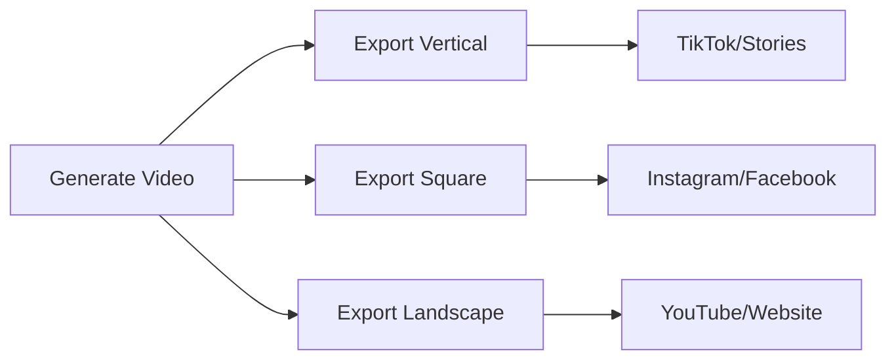

## What is Video Export?

Video export is the process of converting your generated video into a downloadable MP4 file. After video generation is complete, you use the export endpoints to create a final video file that you can download, share, or integrate into your applications.

## Export Process

The export process follows these steps:

<Steps>
  <Step title="Complete Video Generation">
    Ensure your video generation is finished with `status: "completed"`.
  </Step>
  <Step title="Start Export">
    Call `/export/start` with the `video_id` from generation.
  </Step>
  <Step title="Monitor Progress">
    Poll `/export/status/{jobId}` to track export progress.
  </Step>
  <Step title="Download Video">
    Get the download URL when export status becomes `completed`.
  </Step>
</Steps>

## Export Formats

You can export videos in different formats optimized for various platforms:

<CardGroup cols={3}>
  <Card title="Vertical (9:16)" icon="mobile">
    **1080x1920 pixels**
    Perfect for:
    - TikTok
    - Instagram Stories
    - YouTube Shorts
    - Snapchat
  </Card>
  <Card title="Square (1:1)" icon="square">
    **1080x1080 pixels**
    Ideal for:
    - Instagram feed posts
    - Facebook posts
    - LinkedIn posts
    - Twitter videos
  </Card>
  <Card title="Landscape (16:9)" icon="desktop">
    **1920x1080 pixels**
    Best for:
    - YouTube videos
    - Website embeds
    - Presentations
    - Display ads
  </Card>
</CardGroup>

## Cost Structure

Export costs depend on how the video was originally created:

### API-Generated Videos
<Card title="FREE Export" icon="gift" color="#10b981">
  Videos created through the API have export costs **included** in the generation price.
  - **Export cost**: 0 credits
  - **Multiple exports**: Free
  - **Format changes**: Free
</Card>

### Dashboard-Generated Videos  
<Card title="Paid Export" icon="credit-card" color="#f59e0b">
  Videos created through the web dashboard require credits for export.
  - **Export cost**: Varies by video duration
  - **Format conversion**: Additional cost may apply
  - **Multiple exports**: Each export costs credits
</Card>

<Info>
This pricing structure encourages API usage and ensures that programmatic video generation includes all necessary costs upfront.
</Info>

## Export Features

### Format Conversion
- **Change aspect ratio**: Convert vertical videos to square or landscape
- **Resolution optimization**: Automatic resolution scaling for optimal quality
- **Platform optimization**: Format settings optimized for specific social platforms

### Quality Options
- **High definition**: 1080p output for all formats
- **Optimized compression**: Balanced file size and quality
- **Fast encoding**: Quick export processing

### Download Options
- **Direct download URLs**: Secure, time-limited download links
- **Webhook notifications**: Automatic notifications when export completes
- **Batch export**: Export multiple videos simultaneously

## Use Cases

### Content Distribution


### Workflow Integration
1. **Automated Publishing**: Export and automatically upload to social platforms
2. **Content Libraries**: Build collections of branded video content
3. **Multi-Platform Distribution**: Create platform-specific versions of each video
4. **Client Delivery**: Provide downloadable videos to clients

## Best Practices

### 1. Plan Your Formats
Consider your distribution strategy when generating videos:
- Generate in the primary format you'll use most
- Export additional formats as needed
- Use webhooks for automated workflow triggers

### 2. Optimize Downloads
- Download videos immediately when export completes
- Store videos in your own CDN/storage for faster access
- Don't rely on Hoox download URLs for long-term storage

### 3. Error Handling
```python
def export_with_retry(video_id, format="vertical", max_retries=3):
    """Export video with automatic retry logic"""
    for attempt in range(max_retries):
        try:
            # Start export
            response = requests.post(f"{API_BASE}/export/start", 
                json={"video_id": video_id, "format": format})
            job_id = response.json()["job_id"]
            
            # Wait for completion
            while True:
                status_response = requests.get(f"{API_BASE}/export/status/{job_id}")
                status_data = status_response.json()
                
                if status_data["status"] == "completed":
                    return status_data["result"]["video_url"]
                elif status_data["status"] == "failed":
                    if attempt < max_retries - 1:
                        break  # Try again
                    else:
                        raise Exception("Export failed after retries")
                        
                time.sleep(5)  # Wait before checking again
                
        except Exception as e:
            if attempt == max_retries - 1:
                raise e
            time.sleep(10)  # Wait before retry
```

## Technical Specifications

### Video Output
- **Codec**: H.264 (MP4)
- **Audio**: AAC, 44.1kHz stereo
- **Frame Rate**: 30 FPS
- **Bitrate**: Optimized for platform requirements

### File Sizes
Typical file sizes for 60-second videos:
- **Vertical (9:16)**: ~15-25 MB
- **Square (1:1)**: ~12-20 MB  
- **Landscape (16:9)**: ~18-30 MB

### Processing Times
Export processing typically takes:
- **Simple videos**: 30-60 seconds
- **Complex videos with effects**: 1-3 minutes
- **High-resolution content**: 2-5 minutes

## Next Steps

<CardGroup cols={2}>
  <Card title="Start Export" href="/video-export/start-export" icon="play">
    Learn how to initiate video exports
  </Card>
  <Card title="Check Status" href="/video-export/check-status" icon="clock">
    Monitor export progress and get download URLs
  </Card>
</CardGroup>