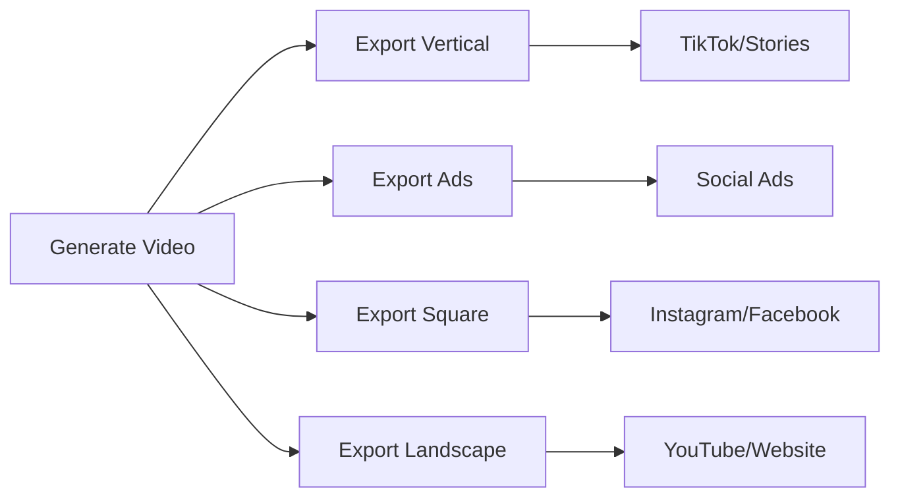

## What is Video Export?

Video export is the process of converting your generated video into a downloadable MP4 file. After video generation is complete, you use the export endpoints to create a final video file that you can download, share, or integrate into your applications.

## Export Process

The export process follows these steps:

<Steps>
  <Step title="Complete Video Generation">
    Ensure your video generation is finished with `status: "completed"`.
  </Step>
  <Step title="Start Export">
    Call `/export/start` with the `video_id` from generation.
  </Step>
  <Step title="Monitor Progress">
    Poll `/export/status/{jobId}` to track export progress.
  </Step>
  <Step title="Download Video">
    Get the download URL when export status becomes `completed`.
  </Step>
</Steps>

## Export Formats

You can export videos in different formats optimized for various platforms:

<CardGroup cols={2}>
  <Card title="Vertical (9:16)" icon="mobile">
    **1080x1920 pixels**
    Perfect for:
    - TikTok
    - Instagram Stories
    - YouTube Shorts
    - Snapchat
  </Card>
  <Card title="Ads (4:5)" icon="rectangle-vertical">
    **1080x1350 pixels**
    Ideal for:
    - Instagram ads
    - Facebook ads
    - Social media advertising
    - Promotional content
  </Card>
  <Card title="Square (1:1)" icon="square">
    **1080x1080 pixels**
    Great for:
    - Instagram feed posts
    - Facebook posts
    - LinkedIn posts
    - Twitter videos
  </Card>
  <Card title="Landscape (16:9)" icon="desktop">
    **1920x1080 pixels**
    Best for:
    - YouTube videos
    - Website embeds
    - Presentations
    - Display content
  </Card>
</CardGroup>

## Use Cases

### Content Distribution

### Workflow Integration
1. **Automated Publishing**: Export and automatically upload to social platforms
2. **Content Libraries**: Build collections of branded video content
3. **Multi-Platform Distribution**: Create platform-specific versions of each video
4. **Client Delivery**: Provide downloadable videos to clients

<Tip>
**Free API Exports**: The first export of any video created through the API is completely free. Additional exports or format changes may incur costs depending on your plan.
</Tip>

## Next Steps

<Card title="Export Status API" href="/api-reference/export/status" icon="code">
  View the complete API documentation for export status
</Card>